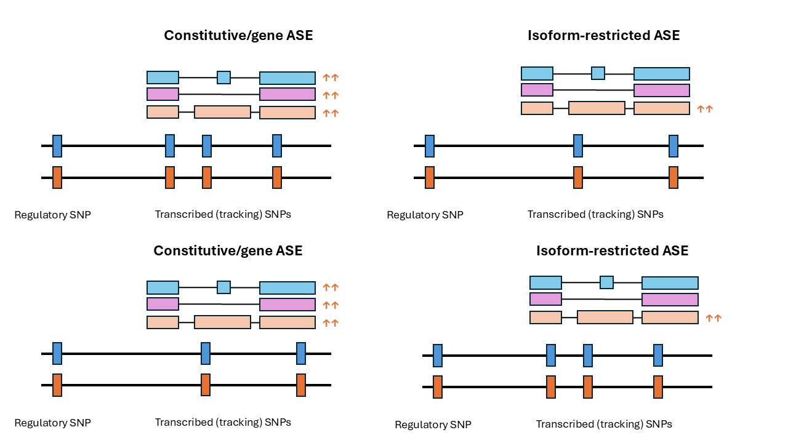

# DChallenge2025
Code and model repository for the(sugar)science DChallenge 2025 data science competition

Example of how the impact of cis regulatory variation on alllelic expression can be measured. In the top left panel is an example of gene-level allelic imbalance: SNPs in transcribed regions (termed "tracking SNPs") in high LD with cis regulatory SNPs are present in exonic regions annotated to all transcripts of this gene. The impact is an overall increase in gene expression from the orange allele, regardless of transcript. In the top right panel is an example of isoform-restricted allelic imbalance (allelic expression affecting only a subset of transcripts of a gene). Here the tracking SNP is located within a region unique to the affected transcript. In the botton left panel is another example of gene-level ASE. Although the tracking SNP is in a transcript-specific sequence, the impact of the orange allele is measureable across all transcripts. In the bottom right panel is another example of isoform-resrtricted ASE: the tracking SNPs are in exons constitutively present in all transcripts of this gene, but the cis regulatory element it is in LD with only affects the expression of one transcript.

